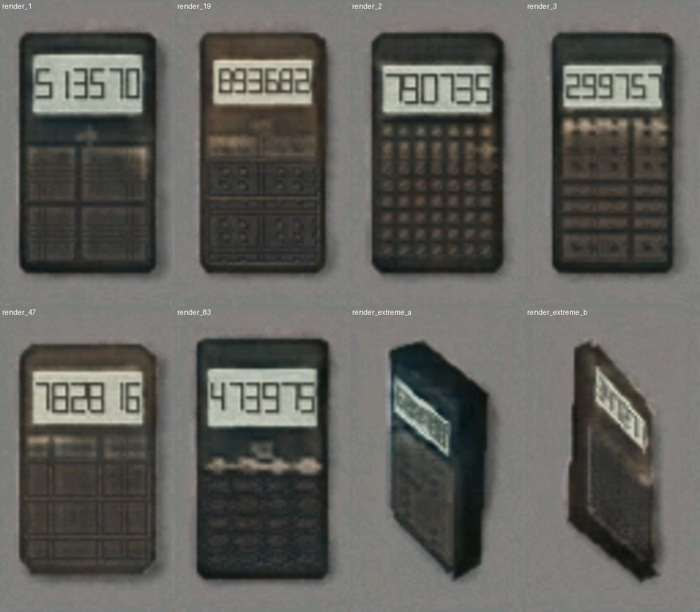
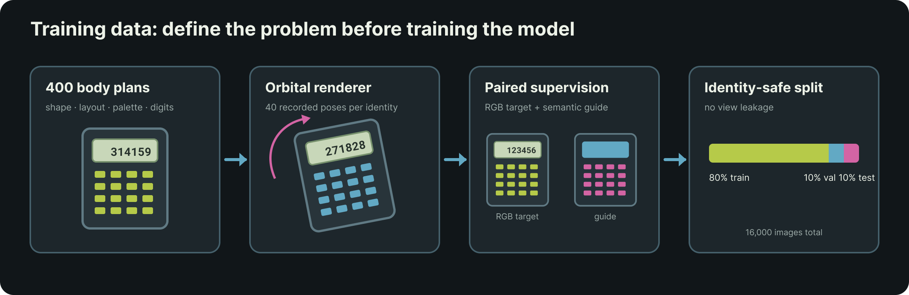
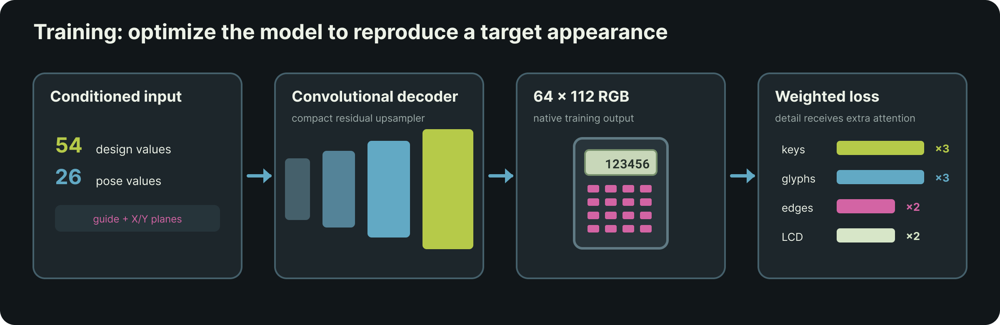
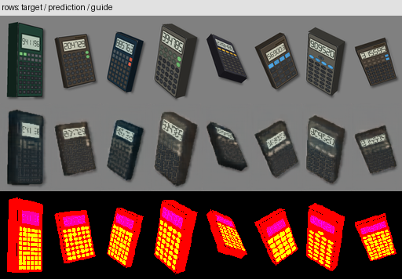
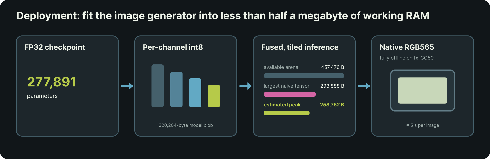

# CalcGen-fx-CG50

**CALC Generator (calculator for short)** is a tiny image generator that runs entirely on the Casio fx-CG50. Choose an orientation, randomise the design, and generate a new 64 × 112 RGB image of a calculator directly on the calculator.

## Try it online

A Hugging Face Space browser demo is available below.

The included [`model/calcgen-v7-fp32.pt`](model/calcgen-v7-fp32.pt) checkpoint contains the model state, 80-value condition size and 64 × 112 output size. 

## Installation

1. Download `CALCGEN4.g3a` from the latest GitHub release.
2. Connect the fx-CG50 by USB and select **USB Flash**.
3. Copy the `.g3a` file to the root of the calculator drive.
4. Eject the calculator. **Calc Gen** will appear in the main menu.

## Controls

| Key | Action |
| --- | --- |
| Up / Down | Tilt the calculator sideways |
| Left / Right | Tilt the calculator vertically |
| F1 | Randomize calculator body plan, keypad and display |
| EXE | Generate an image |
| EXIT | Cancel a render, return to the preview, or quit |

Generation takes roughly six seconds on real hardware.

## Method

### 1. Procedurally generated training data

The dataset contains 400 calculator identities, 40 camera views were created per identity, resulting in 16,000 rendered training images. 
Each identity fixes a combination of:

- body aspect ratio, thickness and corner treatment;
- LCD size and placement;
- four-to-seven keypad columns and five-to-ten rows;
- key shape, navigation pad and calculator palette;
- one of 100 possible display patterns.

Every image uses a middle-grey background. Camera yaw, pitch, framing and projected front/back corners are retained as numeric conditions. Identities, rather than individual views, are split 80/10/10 between training, validation and test sets, preventing alternate views of the same calculator from leaking across splits.

Alongside the target render, the renderer produces a semantic guide. This gives the model explicit geometry, reducing performance demand by preventing it from discovering pose and layout implicitly.

### 2. Decoder training

The model is a compact convolutional decoder with 277,891 parameters. It receives:

- 54 values describing the calculator design;
- 26 values describing camera pose and projected geometry;
- the 64 × 112 semantic guide;
- generated X/Y coordinate planes.

Most learned capacity remains at low spatial resolutions. Later stages use depthwise-separable convolutions. Training ran for 60 epochs on CUDA with extra loss weight assigned for keys, LCD digits and edges.

The final test grid below shows sample target, model generated and guide images:

### 3. Native fx-CG50 deployment

The trained weights are quantised to signed 8-bit values with per-output-channel scaling. The embedded model blob is 320,204 bytes. A tiled and fused inference schedule avoids materialising the largest high-resolution intermediate tensor and keeps the estimated peak working set around 259 KiB.

The preview generator selects one of the 400 training dataset body plans to simplify on-device parameter selection. All 400 plans were checked at every selectable orientation: 25,200 guide combinations, with the LCD and keypad constrained to the projected calculator face.

## Model summary

| Property | Value |
| --- | ---: |
| Output | 64 × 112 RGB |
| Parameters | 277,891 |
| Conditioning | 54 design + 26 pose values |
| Training identities / images | 400 / 16,000 |
| Training epochs | 60 |
| Training compute | 35s / epoch on an RTX4060Ti |
| Inference compute | ~50M MACs per image |
| Embedded int8 blob | 320,204 bytes |
| Estimated peak RAM | 258,752 bytes |
| Add-in packaged size | 451,020 bytes |
